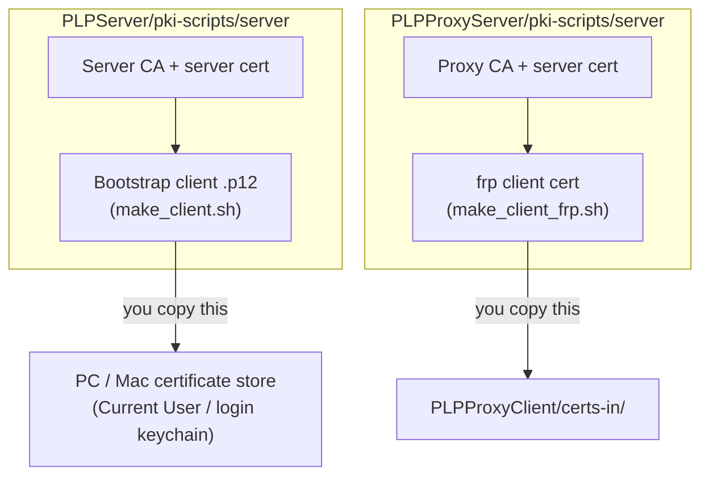
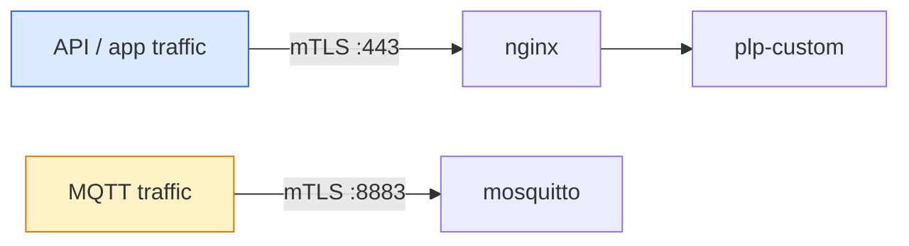
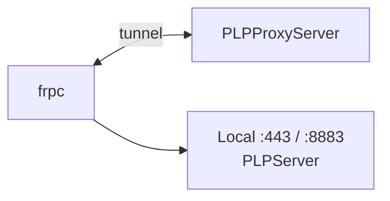

# PhraseLock-Bridge

Interactive, native installers for deploying the Phrase-Lock
backend and its optional reverse-tunnel proxy. Each installer is a
self-contained `install.sh` driven by `whiptail` (or `dialog` on macOS, for
local testing) — plain question/confirm dialogs, no manual config editing.
**PhraseLock-bridge** is required if you want run your own Keepass Installation
as a backend solution.  

## Goal

Every customer gets a backend that is entirely theirs — running on
hardware they own, reachable only by their own devices, with no
third-party service ever seeing their data or credentials. These
installers exist to make that self-hosted setup achievable without deep
Linux/PKI expertise: a guided install to answer, not a manual to follow.

## Architecture


PCs and smartphones are the two actual communication endpoints — everything
between them is infrastructure you **fully own and control**, end to end.
What's actually running in there (`PLPServer`, and optionally
`PLPProxyServer`/`PLPProxyClient` for devices without a fixed IP) is broken
down in the sections below.

## What ends up on the target system

Not the installer package's own layout — this is every file and every
symlink each `install.sh` actually leaves behind on the machine it was run
on. Where an entry has a `→`, that file is not real content of its own —
it's a pointer, reusing the one real file it points to, so the same
certificate/key never has to exist twice.

**PLPServer** — the customer device (e.g. Raspberry Pi):

```
/opt/phraselock/
├── README.txt
├── credentials.txt
├── pki-scripts/
│   ├── server/
│   │   ├── pki.conf.txt, common.sh, make_ca.sh, make_server.sh, make_client.sh
│   │   ├── CA/
│   │   │   ├── ca.<dname>.key
│   │   │   ├── ca.<dname>.pem
│   │   │   ├── ca.<dname>.pkcs8.key
│   │   │   └── ca.<dname>.srl
│   │   ├── server/
│   │   │   ├── <dname>.crt
│   │   │   └── <dname>.key
│   │   └── <dname>/
│   │       ├── <dname>.p12         (bootstrap client cert for PC/Mac import)
│   │       ├── <dname>.pem
│   │       └── <dname>.key
│   └── mqtt/
│       ├── pki.conf.txt, common.sh, make_ca.sh, make_client.sh
│       └── CA/
│           ├── ca.mqtt_8883.key
│           ├── ca.mqtt_8883.pem
│           ├── ca.mqtt_8883.pkcs8.key
│           └── ca.mqtt_8883.srl
└── custom/
    ├── plp-custom-X.Y.jar
    ├── plp-custom.jar → plp-custom-X.Y.jar
    ├── application.properties
    ├── plp-custom.service
    └── certs/CA/
        ├── ca.<dname>.key           (copy — plp-custom issues bootstrap certs)
        ├── ca.mqtt_8883.key         (copy — plp-custom issues MQTT client certs)
        └── ca.mqtt_8883.pem

/etc/nginx/
├── certs/
│   ├── <dname>.crt
│   ├── <dname>.key
│   ├── ca.<dname>.pem
│   ├── server.crt → <dname>.crt
│   ├── server.key → <dname>.key
│   ├── ca.client.pem → ca.<dname>.pem
│   └── client_ca/mqtt_8883/ca.mqtt_8883.pem  (copy, registered with mosquitto below)
├── sites-available/
│   ├── phraselock.conf              (mTLS API reverse proxy)
│   └── silent-drop.conf             (catch-all: drops unmatched port-80 traffic)
└── sites-enabled/
    ├── phraselock.conf → /etc/nginx/sites-available/phraselock.conf
    └── silent-drop.conf → /etc/nginx/sites-available/silent-drop.conf

/etc/mosquitto/
├── mosquitto_8883.conf
├── mosquitto.conf → mosquitto_8883.conf
├── conf_8883.d/ssl.conf
├── certs/
│   ├── bundle.crt → /etc/nginx/certs/ca.<dname>.pem
│   ├── cert.crt → /etc/nginx/certs/<dname>.crt
│   └── cert.key → /etc/nginx/certs/<dname>.key
├── client-ca.8883.d/
│   ├── add-client-ca.sh
│   └── <hash>.0 → /etc/nginx/certs/client_ca/mqtt_8883/ca.mqtt_8883.pem
└── .passwd_8883

/etc/systemd/system/plp-custom.service
```

**PLPProxyServer** — the central proxy (only needed without a fixed IP):

```
/opt/phraselock/pki-scripts-proxy/server/
├── pki.conf.txt, common.sh, make_ca.sh, make_server.sh, make_client_frp.sh
├── CA/
│   ├── ca.<dname>.key
│   ├── ca.<dname>.pem
│   ├── ca.<dname>.pkcs8.key
│   └── ca.<dname>.srl
├── server/
│   ├── <dname>.crt
│   └── <dname>.key
└── <client-name>.FRP/
    ├── <client-name>.crt            (issued for the one PLPProxyClient)
    └── <client-name>.key

/etc/frp/
├── frps.toml
├── frps.service
├── README.txt
├── credentials.txt                  (auth.token)
└── certs/
    ├── <dname>.crt
    ├── <dname>.key
    ├── ca.<dname>.pem
    ├── server.crt → <dname>.crt
    ├── server.key → <dname>.key
    └── ca.crt → ca.<dname>.pem

/etc/nginx/nginx.conf                # stream{} forward only — replaces the stock file
/etc/systemd/system/frps.service → /etc/frp/frps.service
```

**PLPProxyClient** — the customer device, alongside `PLPServer` (only
needed without a fixed IP):

```
/etc/frp/
├── frpc.toml
├── frpc.service
├── README.txt
└── certs/
    ├── client.crt                   # from PLPProxyServer's <client-name>.crt
    ├── client.key                   # from PLPProxyServer's <client-name>.key
    └── ca.crt                       # from PLPProxyServer's ca.<dname>.pem

/etc/systemd/system/frpc.service → /etc/frp/frpc.service
```

## Certificate flow between installers

The three installers generate two entirely separate certificate authorities
— there is no shared PKI between `PLPServer` and `PLPProxyServer`. Each CA's
output only ever leaves its own installer through one manual, deliberately
un-automated copy step:



## Common conventions across all three installers

- **Idempotent**: re-running `install.sh` reuses what already exists (CA,
  certificates, passwords) instead of regenerating it, and only asks again
  for values that are genuinely missing.
- **PKI persisted outside `/tmp`**: the installer package is extracted into
  a staging directory, but generated keys/certificates are copied to a
  permanent location (`/opt/phraselock/...`) on first run, since `/tmp` can
  be cleared on reboot.
- **`README.txt` + `credentials.txt`**: every installer leaves a
  `README.txt` (safe to read/share — explains what was set up and what
  manual step, if any, remains) and, where secrets are involved, a
  separate `credentials.txt` (root-only, `chmod 600`) next to it. Both are
  regenerated at the end of a successful run with the actual resolved
  values, not placeholders.
- **Cancel/Esc-safe prompts**: every `whiptail` input is guarded so
  cancelling an interactive prompt aborts with a clear message instead of
  silently exiting.

## Download

- [PLPServer-0.1.1.tar.gz](https://github.com/phraselock/PhraseLock-Bridge/releases/download/v0.1.1/PLPServer-0.1.1.tar.gz) — customer device (Raspberry Pi or similar)
- [PLPProxyServer-0.1.1.tar.gz](https://github.com/phraselock/PhraseLock-Bridge/releases/download/v0.1.1/PLPProxyServer-0.1.1.tar.gz) — central proxy (only needed without a fixed IP)
- [PLPProxyClient-0.1.1.tar.gz](https://github.com/phraselock/PhraseLock-Bridge/releases/download/v0.1.1/PLPProxyClient-0.1.1.tar.gz) — customer device, alongside `PLPServer` (only needed without a fixed IP)

On a headless server, download and extract directly instead of via browser:

```bash
# PLPServer
curl -LO https://github.com/phraselock/PhraseLock-Bridge/releases/download/v0.1.1/PLPServer-0.1.1.tar.gz
tar xzf PLPServer-0.1.1.tar.gz

# PLPProxyServer
curl -LO https://github.com/phraselock/PhraseLock-Bridge/releases/download/v0.1.1/PLPProxyServer-0.1.1.tar.gz
tar xzf PLPProxyServer-0.1.1.tar.gz

# PLPProxyClient
curl -LO https://github.com/phraselock/PhraseLock-Bridge/releases/download/v0.1.1/PLPProxyClient-0.1.1.tar.gz
tar xzf PLPProxyClient-0.1.1.tar.gz
```

## PLPServer

Installs the customer-facing stack: nginx (mTLS-protected API reverse
proxy), mosquitto (MQTT broker with client-certificate trust store),
`plp-custom` (Java 21 service, installed as a systemd unit), and generates
this device's own PKI (server CA, server certificate, MQTT client CA, and
a bootstrap client `.p12` for API access from a PC/Mac).



```
cd PLPServer
./install.sh
```

Asks once for the server's public IP/hostname, an MQTT broker
username/password, and a password to protect the generated client `.p12`.
See `/opt/phraselock/README.txt` afterward for how to import the `.p12`
certificate (Windows: "Current User" store; Mac: "login" keychain).

## PLPProxyServer

Installs the central reverse-tunnel proxy: `frps` (downloaded binary, not
a package) plus an nginx `stream{}` block doing plain TCP forwarding (no
TLS termination — that still happens on the customer device). Deliberately
**single-tenant**: fixed ports, one client certificate issued automatically
per installation. Multi-tenant proxying is out of scope by design.


```
cd PLPProxyServer
./install.sh
```

Asks for the proxy's public IP/hostname and a name for the one client it
serves. Also supports importing an existing CA (via `certs-in/ca.key` +
`ca.pem`) when migrating this proxy to new hardware, so already-issued
client certificates stay valid.

## PLPProxyClient

Installs `frpc` on the customer device, tunneling its local ports 443 and
8883 out to a `PLPProxyServer`. Does **not** generate its own PKI — the
client certificate must be issued by the proxy server (`make_client_frp.sh`
there) and copied manually into `certs-in/` before running this installer.
That manual transfer step is intentional: whoever controls it controls the
resulting trust relationship, so it's not automated.



```
cd PLPProxyClient
# copy the 3 certificate files from the proxy server into certs-in/ first
./install.sh
```

Asks for the proxy server's address and its `auth.token`.

## Testing

Each installer was built and verified against dedicated test
infrastructure mirroring the two real deployment targets (a Raspberry Pi
and a cloud VPS), including a full end-to-end run with real client devices
communicating through the complete tunnel chain.
