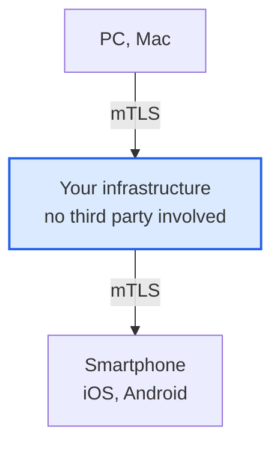
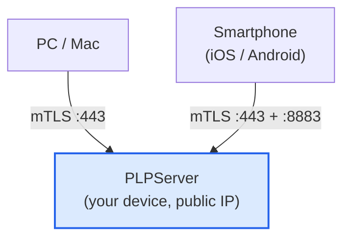
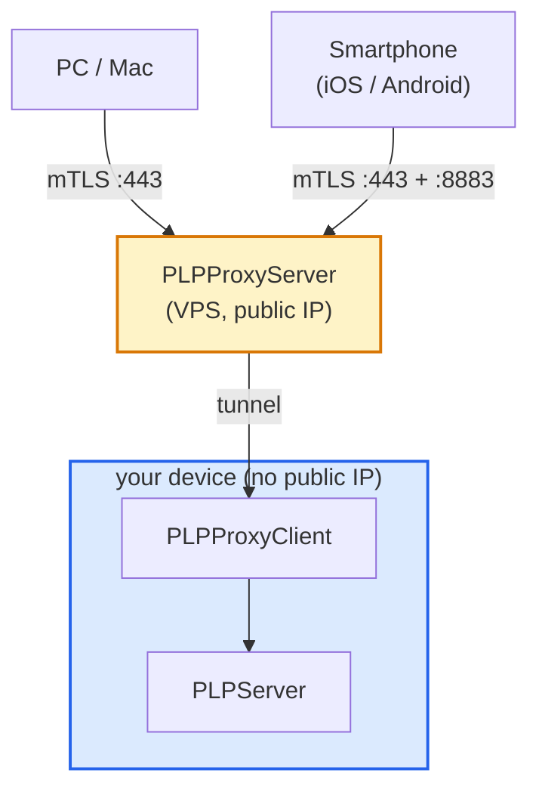
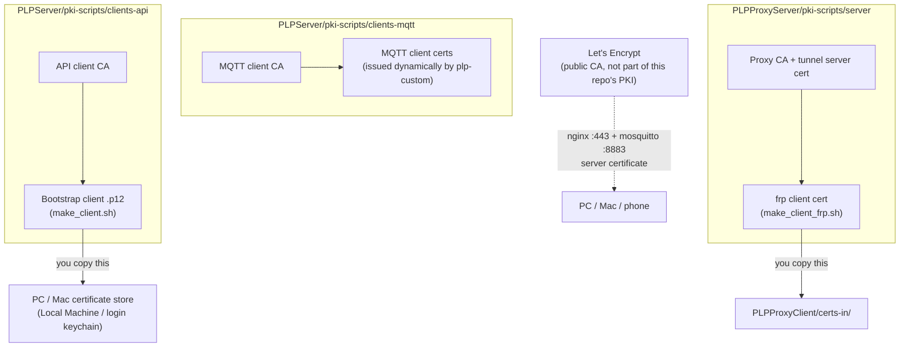
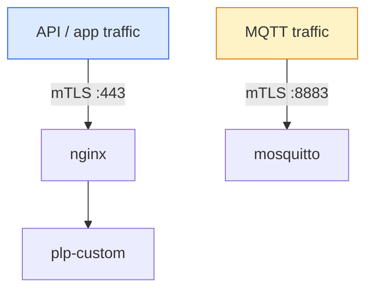
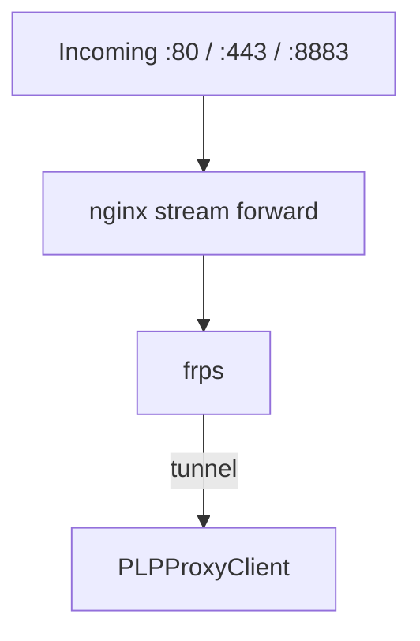
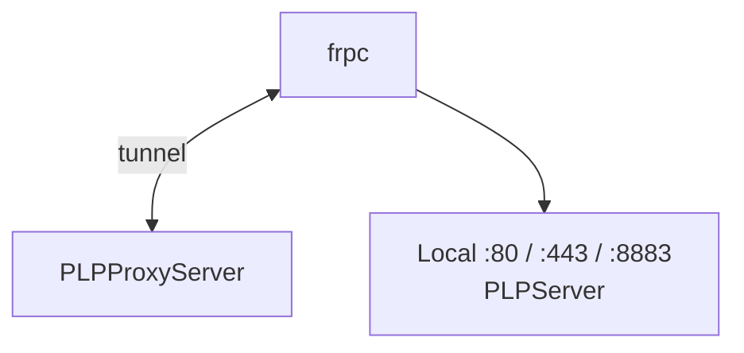

# PhraseLock-Bridge

Interactive, native installers for deploying the Phrase-Lock
backend and its optional reverse-tunnel proxy. Each installer is a
self-contained `install.sh` driven by `whiptail` (or `dialog` on macOS, for
local testing) — plain question/confirm dialogs, no manual config editing.
**PhraseLock-bridge** is required if you want run your own Keepass Installation
as a backend solution.  

## Goal

Every customer gets a backend that is entirely theirs — running on
hardware they own, reachable only by their own devices, with no
third-party service ever seeing their data or credentials. These
installers exist to make that self-hosted setup achievable without deep
Linux/PKI expertise: a guided install to answer, not a manual to follow.

## Architecture



```mermaid
flowchart TD
    PC[PC, Mac] -->|mTLS| Yours[Your infrastructure<br/>no third party involved]
    Yours -->|mTLS| Phone[Smartphone<br/>iOS, Android]

    style Yours fill:#dbeafe,stroke:#2563eb,stroke-width:2px
```


PCs and smartphones are the two actual communication endpoints — everything
between them is infrastructure you **fully own and control**, end to end.
What's actually running in there (`PLPServer`, and optionally
`PLPProxyServer`/`PLPProxyClient` for devices without a fixed IP) is broken
down in the sections below.

## Which components do you need?

That depends on a single question: **does your PLPServer have a fixed, publicly reachable IP address or hostname like myserver.com ?**

### Scenario A — Fixed public IP

Your server (Raspberry Pi, home server, VPS …) is directly reachable from the
internet — either because it has a static public IP, or because you have a
reliable DynDNS entry pointing to it and port-forwarding set up on your router.
In this case your devices connect to it directly. No tunnel, no extra server.

**You only need PLPServer.**


```mermaid
flowchart TD
    PC["PC / Mac"] -->|"mTLS :443"| PS["PLPServer\n(your device, public IP)"]
    Phone["Smartphone\n(iOS / Android)"] -->|"mTLS :443 + :8883"| PS

    style PS fill:#dbeafe,stroke:#2563eb,stroke-width:2px
```

### Scenario B — No fixed public IP (behind NAT or CGNAT)

Your server sits inside a home or company network without a reachable public IP —
maybe because your ISP uses CGNAT, you have no option to port-forward, or you
simply don't want to expose your home router. In this case your devices have no
way to reach PLPServer directly.

The solution is a small VPS (any cheap cloud server with a public IP) running
**PLPProxyServer**. On your own device, **PLPProxyClient** opens a persistent
outbound tunnel to that VPS — outbound connections always work, even behind
strict NAT. Your devices then connect to the VPS, which relays the traffic
through the tunnel to your PLPServer. The VPS only forwards encrypted bytes; it
never terminates TLS and never sees your data.

**You need PLPServer + PLPProxyClient on your device, and PLPProxyServer on a public server / VPS.**


```mermaid
flowchart TD
    PC["PC / Mac"] -->|"mTLS :443"| VPS["PLPProxyServer\n(VPS, public IP)"]
    Phone["Smartphone\n(iOS / Android)"] -->|"mTLS :443 + :8883"| VPS
    VPS -->|"tunnel"| PPC

    subgraph YD["your device (no public IP)"]
        PPC["PLPProxyClient"]
        PS["PLPServer"]
        PPC --> PS
    end

    style VPS fill:#fef3c7,stroke:#d97706,stroke-width:2px
    style YD fill:#dbeafe,stroke:#2563eb,stroke-width:2px
```

## What ends up on the target system

Not the installer package's own layout — this is every file and every
symlink each `install.sh` actually leaves behind on the machine it was run
on. Where an entry has a `→`, that file is not real content of its own —
it's a pointer, reusing the one real file it points to, so the same
certificate/key never has to exist twice.

**PLPServer** — the customer device (e.g. Raspberry Pi):

```
/opt/phraselock/
├── README.txt
├── credentials.txt
├── pki-scripts/
│   ├── clients-api/                 (client certs only — see "Certificate flow" below)
│   │   ├── pki.conf.txt, common.sh, make_ca.sh, make_server.sh, make_client.sh
│   │   ├── CA/
│   │   │   ├── ca.<dname>.key
│   │   │   ├── ca.<dname>.pem
│   │   │   ├── ca.<dname>.pkcs8.key
│   │   │   └── ca.<dname>.srl
│   │   └── <dname>/
│   │       ├── <dname>.p12         (bootstrap client cert for PC/Mac import)
│   │       ├── <dname>.pem
│   │       └── <dname>.key
│   └── clients-mqtt/
│       ├── pki.conf.txt, common.sh, make_ca.sh, make_client.sh
│       └── CA/
│           ├── ca.mqtt_8883.key
│           ├── ca.mqtt_8883.pem
│           ├── ca.mqtt_8883.pkcs8.key
│           └── ca.mqtt_8883.srl
└── custom/
    ├── plp-custom-X.Y.jar
    ├── plp-custom.jar → plp-custom-X.Y.jar
    ├── application.properties
    ├── plp-custom.service
    └── certs/CA/
        ├── ca.<dname>.key → /opt/phraselock/pki-scripts/clients-api/CA/ca.<dname>.key
        ├── ca.mqtt_8883.key → /opt/phraselock/pki-scripts/clients-mqtt/CA/ca.mqtt_8883.key
        └── ca.mqtt_8883.pem → /opt/phraselock/pki-scripts/clients-mqtt/CA/ca.mqtt_8883.pem

/etc/letsencrypt/                    (managed by certbot — the actual server certificate)
├── live/<dname>/{fullchain,privkey,cert,chain}.pem
├── renewal/<dname>.conf
└── renewal-hooks/deploy/
    ├── 01-reload-nginx.sh           (reload only — nginx reads the live/ symlinks directly)
    └── 02-reload-mosquitto.sh       (copies fullchain/privkey — mosquitto can't read live/ in place)

/opt/certbot/                        (certbot's own venv — pip install, not apt/snap)
/var/www/certbot/                    (ACME HTTP-01 challenge webroot)
/etc/systemd/system/certbot-renew.{service,timer}

/etc/nginx/
├── certs/
│   ├── server.crt → /etc/letsencrypt/live/<dname>/fullchain.pem
│   ├── server.key → /etc/letsencrypt/live/<dname>/privkey.pem
│   └── ca.client.pem → /opt/phraselock/pki-scripts/clients-api/CA/ca.<dname>.pem
├── sites-available/
│   ├── phraselock_80.conf           (ACME HTTP-01 challenge vhost)
│   ├── phraselock.conf              (mTLS API reverse proxy)
│   └── silent-drop.conf             (catch-all: drops unmatched traffic)
├── sites-enabled/
│   ├── phraselock_80.conf → /etc/nginx/sites-available/phraselock_80.conf
│   ├── phraselock.conf → /etc/nginx/sites-available/phraselock.conf
│   └── silent-drop.conf → /etc/nginx/sites-available/silent-drop.conf
└── phraselock.d/                    (drop-in location blocks — written by plp-backend/plp-fido2 installers)

/etc/mosquitto/
├── mosquitto_8883.conf
├── mosquitto.conf → mosquitto_8883.conf
├── conf_8883.d/ssl.conf
├── certs/
│   ├── fullchain.pem, privkey.pem   (own copy — mosquitto can't read /etc/letsencrypt in place)
│   ├── server.crt → fullchain.pem
│   └── server.key → privkey.pem
├── client-ca.8883.d/
│   ├── add-client-ca.sh
│   └── <hash>.0 → /opt/phraselock/pki-scripts/clients-mqtt/CA/ca.mqtt_8883.pem
└── .passwd_8883

/etc/systemd/system/plp-custom.service → /opt/phraselock/custom/plp-custom.service
```

Note what's *not* here: an `/etc/nginx/certs/<dname>.crt`-style self-signed server certificate. `pki-scripts/clients-api/` still ships `make_server.sh` (for a fully self-signed, no-public-DNS fallback — see "Certificate flow" below), but `install.sh` no longer calls it; nginx's and mosquitto's `server.crt`/`server.key` come exclusively from Let's Encrypt now.

**PLPProxyServer** — the central proxy (only needed without a fixed IP):

```
/opt/phraselock/pki-scripts-proxy/server/
├── pki.conf.txt, common.sh, make_ca.sh, make_server.sh, make_client_frp.sh
├── CA/
│   ├── ca.<dname>.key
│   ├── ca.<dname>.pem
│   ├── ca.<dname>.pkcs8.key
│   └── ca.<dname>.srl
├── server/
│   ├── <dname>.crt
│   └── <dname>.key
└── <client-name>.FRP/
    ├── <client-name>.crt            (issued for the one PLPProxyClient)
    └── <client-name>.key

/etc/frp/
├── frps.toml
├── frps.service
├── README.txt
├── credentials.txt                  (auth.token)
└── certs/
    ├── <dname>.crt
    ├── <dname>.key
    ├── server.crt → <dname>.crt
    ├── server.key → <dname>.key
    └── ca.crt → /opt/phraselock/pki-scripts-proxy/server/CA/ca.<dname>.pem

/etc/nginx/nginx.conf                # stream{} forward only — replaces the stock file
/etc/systemd/system/frps.service → /etc/frp/frps.service
```

**PLPProxyClient** — the customer device, alongside `PLPServer` (only
needed without a fixed IP):

```
/etc/frp/
├── frpc.toml
├── frpc.service
├── README.txt
└── certs/
    ├── client.crt                   # from PLPProxyServer's <client-name>.crt
    ├── client.key                   # from PLPProxyServer's <client-name>.key
    └── ca.crt                       # from PLPProxyServer's ca.<dname>.pem

/etc/systemd/system/frpc.service → /etc/frp/frpc.service
```

## Certificate flow between installers

`PLPServer`'s actual server TLS certificate (nginx `:443`, mosquitto
`:8883` — the one every PC/phone validates) comes from **Let's Encrypt**,
not from any of this project's own PKI. Self-signed server certificates
stopped being viable once clients (notably iOS 26+) began rejecting them
outright, and a publicly trusted CA solves that outright instead of trying
to work around it.

What the installers' own PKI scripts generate instead are three entirely
separate, unrelated **client**-certificate CAs — none of them ever signs a
server certificate for a public-facing endpoint, and none of them trusts
another's certificates:

| CA | Directory | Signs |
|---|---|---|
| API client CA | `PLPServer/pki-scripts/clients-api` | the bootstrap `.p12` + dynamically issued API client certs |
| MQTT client CA | `PLPServer/pki-scripts/clients-mqtt` | client certs for mosquitto's `:8883` mTLS |
| Proxy CA | `PLPProxyServer/pki-scripts/server` | frp client certs, **and** the frps↔frpc tunnel's own server cert (an internal, infra-only TLS session between your own machines — never seen by an end-user device, so no public CA is needed here) |

Keeping these apart matters: a certificate issued by one must never pass
as valid against another (see the mosquitto `capath`-only trust config in
`PLPServer/install.sh`). Each CA's output only ever leaves its own
installer through one manual, deliberately un-automated copy step:


```mermaid
flowchart TD
    subgraph S["PLPServer/pki-scripts/clients-api"]
        SCA[API client CA]
        SCA --> P12["Bootstrap client .p12<br/>(make_client.sh)"]
    end
    P12 -->|you copy this| PCMac["PC / Mac certificate store<br/>(Local Machine / login keychain)"]

    subgraph SM["PLPServer/pki-scripts/clients-mqtt"]
        MCA[MQTT client CA]
        MCA --> MCert["MQTT client certs<br/>(issued dynamically by plp-custom)"]
    end

    subgraph P["PLPProxyServer/pki-scripts/server"]
        PCA[Proxy CA + tunnel server cert]
        PCA --> FRPCert["frp client cert<br/>(make_client_frp.sh)"]
    end
    FRPCert -->|you copy this| CI["PLPProxyClient/certs-in/"]

    LE["Let's Encrypt<br/>(public CA, not part of this repo's PKI)"] -.->|"nginx :443 + mosquitto :8883<br/>server certificate"| Devices["PC / Mac / phone"]
```

## Common conventions across all three installers

- **Idempotent**: re-running `install.sh` reuses what already exists (CA,
  certificates, passwords) instead of regenerating it, and only asks again
  for values that are genuinely missing.
- **PKI persisted outside `/tmp`**: the installer package is extracted into
  a staging directory, but generated keys/certificates are copied to a
  permanent location (`/opt/phraselock/...`) on first run, since `/tmp` can
  be cleared on reboot.
- **`README.txt` + `credentials.txt`**: every installer leaves a
  `README.txt` (safe to read/share — explains what was set up and what
  manual step, if any, remains) and, where secrets are involved, a
  separate `credentials.txt` (root-only, `chmod 600`) next to it. Both are
  regenerated at the end of a successful run with the actual resolved
  values, not placeholders.
- **Cancel/Esc-safe prompts**: every `whiptail` input is guarded so
  cancelling an interactive prompt aborts with a clear message instead of
  silently exiting.

## Installation

Each component has its own one-liner. Run the right one on the right machine:

**PLPServer** — customer device (Raspberry Pi or Linux server with a fixed IP):
```bash
curl -sSL https://raw.githubusercontent.com/phraselock/PhraseLock-Bridge/main/install.sh | sudo bash -s PLPServer
```

**PLPProxyServer** — central proxy VPS (only needed without a fixed IP):
```bash
curl -sSL https://raw.githubusercontent.com/phraselock/PhraseLock-Bridge/main/install.sh | sudo bash -s PLPProxyServer
```

**PLPProxyClient** — customer device tunnel client, alongside PLPServer (only needed without a fixed IP):
```bash
curl -sSL https://raw.githubusercontent.com/phraselock/PhraseLock-Bridge/main/install.sh | sudo bash -s PLPProxyClient
```

Individual tarballs for the [latest release](https://github.com/phraselock/PhraseLock-Bridge/releases/latest) are also available if you prefer to download manually.

## PLPServer

Installs the customer-facing stack: nginx (mTLS-protected API reverse
proxy) and mosquitto (MQTT broker with client-certificate trust store),
both getting their server TLS certificate from Let's Encrypt via `certbot`
(auto-renewing, systemd timer + deploy hooks — see "Certificate flow"
above), plus `plp-custom` (Java 21 service, installed as a systemd unit).
Also generates this device's own client-certificate PKI: a CA for API
access (with a bootstrap `.p12` for a PC/Mac) and a separate CA for MQTT
broker access — kept apart on purpose, so a certificate for one can never
authenticate as the other.


```mermaid
flowchart TD
    A[API / app traffic] -->|mTLS :443| N[nginx] --> C[plp-custom]
    M[MQTT traffic] -->|mTLS :8883| Q[mosquitto]

    style A fill:#dbeafe,stroke:#2563eb
    style M fill:#fef3c7,stroke:#d97706
```

```
cd PLPServer
./install.sh
```

Asks once for the server's public **domain name** (must already resolve
here via DNS — Let's Encrypt validates ownership over port 80 before
issuing the certificate; a bare IP address no longer works, unlike before),
an e-mail address for Let's Encrypt renewal notices, an MQTT broker
username/password, and a password to protect the generated client `.p12`.
See `/opt/phraselock/README.txt` afterward for how to import the `.p12`
certificate (Windows: "Local Machine" store — the client runs as a
service with admin rights, available at the lock screen before login;
Mac: "login" keychain).

> [!WARNING]
> **The `pl.core.jwt` token install.sh fetches automatically is
> temporary** — valid only a few days, just enough to get this install
> working right away. For a backend you intend to keep running, you must
> separately request a proper, long-lived token from PhraseLock (free, but
> not self-service — you have to ask for it) and replace `pl.core.jwt` in
> `/opt/phraselock/custom/application.properties` with it, then
> `systemctl restart plp-custom`. See `/opt/phraselock/README.txt` for the
> full instructions.

> [!WARNING]
> **Import the bootstrap client `.p12` to the exact store/location**
> called out in `/opt/phraselock/README.txt` — "Local Machine" on Windows
> (the client runs as an admin-rights service, available at the lock
> screen before login — not "Current User"), the "login" keychain on Mac.
> Get this wrong and client apps simply won't find the certificate, with
> no obvious
> error pointing back to the import step.

## PLPProxyServer

Installs the central reverse-tunnel proxy: `frps` (downloaded binary, not
a package) plus an nginx `stream{}` block doing plain TCP forwarding for
three tunnels — `:80` (so the customer's own `certbot`, behind this proxy,
can still complete its Let's Encrypt HTTP-01 challenge), `:443` and `:8883`
— no TLS termination anywhere, that still happens on the customer device.
Deliberately **single-tenant**: fixed ports, one client certificate issued
automatically per installation. Multi-tenant proxying is out of scope by
design.


```mermaid
flowchart TD
    In[Incoming :80 / :443 / :8883] --> N[nginx stream forward] --> F[frps] -->|tunnel| Out[PLPProxyClient]
```

```
cd PLPProxyServer
./install.sh
```

Asks for the proxy's public IP/hostname and a name for the one client it
serves. Also supports importing an existing CA (via `certs-in/ca.key` +
`ca.pem`) when migrating this proxy to new hardware, so already-issued
client certificates stay valid.

## PLPProxyClient

Installs `frpc` on the customer device, tunneling its local ports 80, 443
and 8883 out to a `PLPProxyServer`. Does **not** generate its own PKI — the
client certificate must be issued by the proxy server (`make_client_frp.sh`
there) and copied manually into `certs-in/` before running this installer.
That manual transfer step is intentional: whoever controls it controls the
resulting trust relationship, so it's not automated.


```mermaid
flowchart TD
    Frpc[frpc] <-->|tunnel| Server[PLPProxyServer]
    Frpc --> Local[Local :80 / :443 / :8883<br/>PLPServer]
```

```
cd PLPProxyClient
# copy the 3 certificate files from the proxy server into certs-in/ first
./install.sh
```

Asks for the proxy server's address and its `auth.token`.

## Testing

Each installer was built and verified against dedicated test
infrastructure mirroring the two real deployment targets (a Raspberry Pi
and a cloud VPS), including a full end-to-end run with real client devices
communicating through the complete tunnel chain.

The Let's Encrypt migration was verified both as a fresh install (real
certificate issued via the HTTP-01 webroot challenge, `certbot renew
--dry-run` succeeding, both nginx and mosquitto presenting a certificate
that validates against the system trust store with no pinning) and as an
in-place upgrade of an already-installed PLPServer (old `pki-scripts/server`
and `mqtt` directories and mosquitto's old certificate filenames migrated
automatically, nothing left behind). The PLPProxyServer/PLPProxyClient
port-80 tunnel was verified end-to-end separately: a request from the
public internet through the proxy's new `:80` forward reached the correct
vhost on the origin server behind it.
